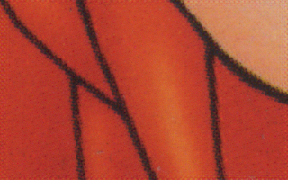
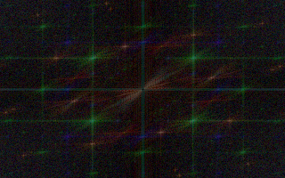
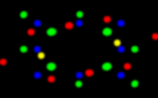
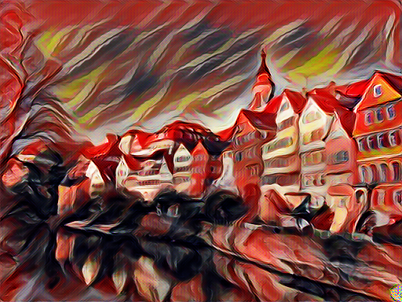
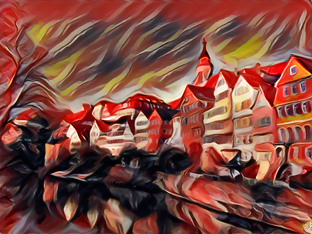

# Fourier transform descreen filter

An implementation of GIMP [descreen plugin](http://web.archive.org/web/20161118075437/http://registry.gimp.org/node/24411) in python with OpenCV. It utilizes a custom normalization of magnitude spectrum, found in [fft plugin](http://web.archive.org/web/20161118081031/http://registry.gimp.org/node/19596), which assigns more energy to pixels further away from the center, thus allowing to use regular binary threshold to localize high frequency areas and create a mask automatically. It turned out to be very helpful in case of periodic pattern removal, therefor I adapted it for python.

## Usage

```
python descreen.py images/example.png images/result.png
```

 

Optional arguments include

* `--thresh INT, -t INT` - Threshold level for normalized magnitude spectrum
* `--radius INT, -r INT` - Radius to expand the area of mask pixels
* `--middle INT, -m INT` - Ratio for middle preservation

The normalized spectrum and its multi-channel mask of the above example respectively

 

## Motivation

Originally intended to clean up deconvolution [checkerboard artifacts](http://distill.pub/2016/deconv-checkerboard), found in style transferred images, I thought it may have its uses in other areas, like cleaning low-dpi scans and therefor would be better off as a separate script. I excluded the optional despeckle step, found in original plugin for being too destructive. Instead, I find [waifu2x](//github.com/nagadomi/waifu2x) to give a superior result in case of artistically styled images, thus tend to use it with maximum noise reduction as a second step.

Original image



fft-descreen + waifu noise removal

